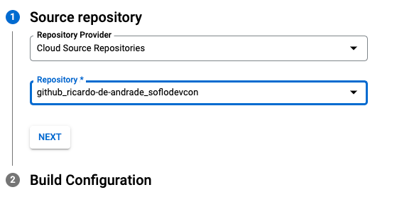

# South Florida DevCon 2022 - CloudRun demo

This repo contains all that’s needed to run the same demo on your own.


## Requirements


* Google Cloud Account
    * Feel free to get a free one at [https://cloud.google.com/free](https://cloud.google.com/free)
* Google Cloud CLI 
    * Install: [https://cloud.google.com/sdk/docs/install](https://cloud.google.com/sdk/docs/install) 
    * Set up: [https://cloud.google.com/sdk/docs/install-sdk#initializing_the](https://cloud.google.com/sdk/docs/install-sdk#initializing_the) 
* For local development:
    * Node.js
    * Git
    * Docker (optional)
* 30 minutes of free time


## Local set up

The first step is to build an app and run it locally. We used a simple hello-world in node.js

_* you can clone this repo locally and use the start directory as your starting point_

app.js

```js
const express = require('express');
const app = express();
const path = require('path');

app.get('/', function(req, res){
  console.log(req.ip + " requesting " + req.originalUrl)

  res.send("Hello World!!");
});

app.listen(8080, function(){
  console.log("Listening on port 8080!")
});
```


To run it, simple invoke node with the app name:


```
node app.js
```


And to test, open your browser on http://localhost:8080

You should see a simple page with the ‘Hello World!!’ message in it.

The problem here is that this is only running locally, and not available to other users. Even if we make configurations to somehow route to the app (see https://ngrok.com/), it would not scale well if we decided this is how we are hosting our app. Furthermore, our process is still manual.


## Deploy to CloudRun

The easiest way to deploy to CloudRun is directly from the source itself. Simply run:


```
gcloud run deploy
```


This will run interactively. Use the following for your answers:


* Source code location: your current directory (hit enter)
* Service name: test1 (or any other name will do)
* Region: [24] us-east1 (or your closest region)


### Got an error?


We did not define our dependencies. In node.js we need to list the dependencies in a file called package.json.

Although the app runs locally without it, it is always recommended that you list all your dependencies. It is even more important for more complex applications.

package.json

```json
{
    "name": "soflodevcon",
    "version": "1.0.0",
    "main": "app.js",
    "scripts": {
        "start": "node ."
    },
    "author": "Ricardo de Andrade",
    "dependencies": {
        "express": "^4.17.1"
    }
}
```

After creating the above file, re-run the gcloud command

```
gcloud run deploy
```


Assuming everything went ok, you should see a link created that you use to access the app.

In the cloud console, you should also be able to see the app’s details and its status.

**Success!!**


### Magic

There’s some ‘magic’ happening behind the scenes and CloudRun is doing a lot of cool things _automagically_ for us.


* Build
    * CloudRun looks into the source and decides how to build the code and container. You can define your own Dockerfile (there’s an example in the repo), or let CloudRun use buildpacks to build the container and use it to deploy
    * All the logs for the build are available in the Google Cloud Console under Cloud Build
* Deploy
    * Once the build is done, the image for our container is sent to the Artifact Repository (similar to container registry), and deployed from there.
* Load Balancer
    * CloudRun by default will generate a publicly accessible URL and set it to a load balancer in front of the application - no extra work or configurations are required. You can also have your own custom domain (https://cloud.google.com/run/docs/mapping-custom-domains)
* Publish
    * Once the application is up and ready, and the load balancer configured, the instance created is added to the load balancer, officially making it available to traffic. Your app is live now!!
* Scale
    * CloudRun will automatically monitor and scale the app as needed. When there’s no traffic, it’ll scale down to 0.


## Does it scale?

We can be here all day hitting the refresh button in order to send traffic to our newly deployed cloud app, or, we can be lazy and automate it.

You can use `curl` in the command line to invoke any URL

* remember to go easy on it to avoid charges. CloudRun will charge you for the traffic your service sees. Try to stay within the allowed number of free requests. - https://cloud.google.com/run/pricing

```
curl https://<URL created at deployment>.a.run.app
```


To invoke it 100 times in sequence:


```
for i in {1..100} ; do curl -s -o /dev/null https://<URL created at deployment>.a.run.app; done
```


And, in parallel: 


```
for i in {1..100} ; do curl -s -o /dev/null https://<URL created at deployment>.a.run.app & done
```


Check the CloudRun dashboard and look for how many instances were created. Adjust the number of runs if it seems 100 is too little. Try 1000 or more as needed.

But... the code is still locally in my machine and my build and deploy process is still manual.


## CI/CD

CloudRun offers an easy solution to integrate with CloudBuild and a source repository.

If you don’t have a repository yet, now is the time to create one and add your code to it.

In CloudRun, click on the “Set up continuous deployment” button at the top of the screen (once you click on your CloudRun service


Set up your deployment to your own configurations, in my case, I have my git repository synced to a Google Cloud Source Repository and will use that:





Click on Next


You can leave all the default values and click on  Save. Optionally, you can decide to use a Dockerfile or change the entrypoint to maybe pass in some parameters to your application.

Now that you have your repository linked to the build and deploy process, all you need is to make changes to your code, commit it and watch it build and deploy automatically.


## Let’s up the ante

So far, so good. But it is not realistic.

This is a single file app.

Let’s change our app to return other content from other files:

app.js
```js
const express = require('express');
const app = express();
const path = require('path');

app.listen(8080, function(){
  console.log("Listening on port 8080!")
});

app.get('/', function(req, res){
  console.log(req.ip + " requesting " + req.originalUrl)

  res.sendFile(path.join(__dirname, '/index.html'));
}); 

app.get('/img.png', function(req, res){
  console.log(req.ip + " requesting " + req.originalUrl)

  res.sendFile(path.join(__dirname, '/img.png'));
}); 

```


As you can see, we now rely on 2 other files:


* index.html
* img.png

These files are available in the repo and if you are using the start directory, you can copy them from one level up (commands below assume a linux like terminal):


```
cp ../index.html .
cp ../img.png .
```

And to close it all up, let's commit this puppy and let the magic begin!!
